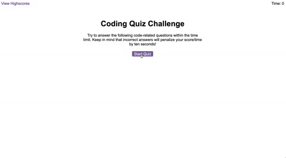

# High-Score

JavaScript is the name. Getting the high score is the game. Welcome to fundamentals of JavaScript. Here is a quick quiz to test your basic knowledge of JavaScript and its uses.

## Rules

The goal is to sit on top of the leader board with the high score! A timer will be counting down in the top right of your window, and you will have 75 seconds to answer 5 multiple-choice questions, reiving a score after all questions have been answered. Beware, with every wrong answer, ten seconds will be taken off the remaining time you have left on your timer. May the high score be with you.

## Quiz Link

https://taholton748.github.io/High-Score/

## Created with:

- HTML
- CSS
- JavaScript

## Contact

<strong>Tyler Holton</strong>

Email: taholton748@yahoo.com

Github: https://github.com/taholton748
